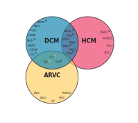

# Penetrance and disease expression of (likely) pathogenic variants associated with inherited cardiomyopathies in the general population

[](https://doi.org/10.1101/2022.01.06.22268837)
[](https://choosealicense.com/licenses/cc-by-sa-4.0)


> This README and repository accompany the paper _"Penetrance and disease expression of (likely) pathogenic variants associated with inherited cardiomyopathies in the general population"_ by [Bourfiss M. *et al*. **medRxiv 2022**](https://doi.org/10.1101/2022.01.06.22268837).
--------------


(Likely) pathogenic variants associated with arrhythmogenic cardiomyopathy (ACM), dilated cardiomyopathy (DCM) and hypertrophic cardiomyopathy (HCM) are recommended to be reported as secondary findings in genome sequencing studies. This provides opportunities for early diagnosis, but also fuels uncertainty in variant carriers (G+), since disease penetrance is incomplete. We assessed the prevalence and disease expression of G+ in the general population.

# Methods
:warning: Scripts and examples in this repository are shared for transparency purpose only and may therefore not work on other systems without modifications.
## Genetic variants in the study population
We identified carriers of a (likely) pathogenic variant associated with ACM, DCM or HCM in individuals from the UK Biobank who underwent WES (n=200,643 at time of analysis). For each inherited cardiomyopathy we selected curated genes classified to have definite, strong or moderate evidence of pathogenicity (see Figure 1).


**Figure 1. Included curated genes per cardiomyopathy**    
The Venn diagram of curated genes included in this study shows the overlap in genes per cardiomyopathy. Unless otherwise indicated, pathogenicity of genes are classified as definitive. If a superscript S or M is given, genes are classified as having a strong or moderate pathogenicity respectively. In the overlapping circles, yellow, black and red colors refer to ACM, DCM, and HCM respectively. [Supplementary Table 1](docs/manuscript/Supplementary_Tables.xlsx) gives an overview of the included genes and pathogenicity classification per gene and abbreviation per gene.     
*Abbreviations: ACM= arrhythmogenic cardiomyopathy; DCM= dilated cardiomyopathy; HCM= hypertrophic cardiomyopathy.*


### [ClinVar database](https://www.ncbi.nlm.nih.gov/clinvar/)   
To extract (likely) pathogenic variants for ACM, DCM and HCM from ClinVar:

- In ClinVar search for the cardiomyopathy of interest:  
  1. ACM: ""Arrhythmogenic right ventricular cardiomyopathy"[dis] OR "Arrhythmogenic right ventricular dysplasia"[dis] OR "Arrhythmogenic cardiomyopathy"[dis]"
  2. DCM: "Dilated cardiomyopathy"[dis]
  3. HCM: "Hypertrophic cardiomyopathy"[dis]    


- Filter for pathogenic and likely pathogenic on the left side list.
- Download file with these features; Format:Tabular (text), Sort by:Location.

### [VKGL database](https://vkgl.molgeniscloud.org/menu/main/dataexplorer?entity=vkgl_public_consensus&hideselect=true&mod=data#)
To extract (likely) pathogenic variants for ACM, DCM and HCM from the VKGL database:
- In the data item filters wizard:
  - Select Classification: (Likely) Pathogenic
  - In the Gene box, insert the genes from the curated list per cardiomyopathy
- Download as CSV


### Prepare the final list of (likely) pathogenic variants
- Run the `prep_SNP.sh` script with the following arguments:
  - Argument 1: The phenotype for which the ClinVar-file was downloaded, so **ACM, DCM, or HCM**
  - Argument 2: The path to and name of the ClinVar-file
  - Argument 3: The path to and name of the VKGL-file
  - Argument 4: The path to and name of the log file
  - This script expects a file called [`CM_genes.txt`](data/temp/CM_genes.txt) in the `data/temp` folder, containing one column with the genes of the curated gene list and the second column containing the corresponding cardiomyopathy
```
prep_SNPs.sh [arg1] [arg2] [arg3] [arg4]
```

Indel variants are mistakenly not included in the data. This has to be done manually. To include them, perform the following steps in 2 terminal screens (where `${DIS}` stands for ACM or DCM or HCM):
  - In screen 1: find overlap of insertion and deletion:    
    1. `bin/overlap.pl ${DIS}_overlap_LP_WES_SNPs.txt 1 ${DIS}_overlap_LP_WES_SNPs.txt_position 1 -v | awk '$1 ~ /I/ {print $0}' | less` # get non-overlap Insertion    
    2. `bin/overlap.pl ${DIS}_overlap_LP_WES_SNPs.txt 1 ${DIS}_overlap_LP_WES_SNPs.txt_position 1 -v | awk '$1 ~ /D/ {print $0}' | less`  # get non-overlap Deletion   
  - In screen 2: search in `${DIS}_LP_positionID`:   
    1. Open the file and search each position from screen 1 "column2", then check if the indel is the same   
    2. Compare indel in overlap to the one in `${DIS}_LP_positionID` file
    3. Add matched indels to a file and save

For pathogenic variants mentioned in the VKGL database, which does not specify disease associations, association with one of the cardiomyopathies was confirmed in ClinVar.

### Extract variant carriers from the UK Biobank
After completion of the pathogenic variant list, the indel list and the list of variants to be removed (due to no association with cardiomyopathy or any other reason), the UK Biobank individuals carrying a variant are extracted using the script [`extract_IID.sh`](src/extract_IID.sh) and arguments:
- Argument 1: The phenotype, so **ACM, DCM, or HCM**
- Argument 2: The path to and name of the indel-file
- Argument 3: The path to and name of the log file
- This script expects a file called `ACM/DCM/HCM_remove_overlap.txt` in the `data/raw` folder containing one variant per line to be removed from the variant list
- This script will also execute the R-script [`Extract_IID_WES_UKB.R`](src/Extract_IID_WES_UKB.R) and the output file for ACM will be `data/temp/ACM_temp/ACM_IIDs_genes_variants.txt`, which contains the following named columns:
  1. ID - ID of UK Biobank participant
  2. LV - Availability of LV CMR data (Yes/NA)
  3. RV - Availability of RV CMR data (Yes/NA)
  4. XX_variant - One column per gene, indicating number of variants this individual carries in this gene
  5. Total_variants - Last column indicating total number of variants in this individual

```
extract_IID.sh [arg1] [arg2] [arg3]
```

:warning: To use this script, some directories in the script have to be changed. These are the directories to the [plink executable](https://github.com/CirculatoryHealth/Inherited-cardiomyopathies/blob/a978a1dea274d7e87f91d688a75c58a300222b21/src/extract_IID.sh#L98), the path to and prefix of the [UK Biobank bed files](https://github.com/CirculatoryHealth/Inherited-cardiomyopathies/blob/a978a1dea274d7e87f91d688a75c58a300222b21/src/extract_IID.sh#L99), the path to and prefix of the [UK Biobank bim files](https://github.com/CirculatoryHealth/Inherited-cardiomyopathies/blob/a978a1dea274d7e87f91d688a75c58a300222b21/src/extract_IID.sh#L100), the path to and prefix of the [UK Biobank fam files](https://github.com/CirculatoryHealth/Inherited-cardiomyopathies/blob/a978a1dea274d7e87f91d688a75c58a300222b21/src/extract_IID.sh#L101) and the files for the IDs of UK Biobank participants for which [LV](https://github.com/CirculatoryHealth/Inherited-cardiomyopathies/blob/a978a1dea274d7e87f91d688a75c58a300222b21/src/extract_IID.sh#L102) and [RV](https://github.com/CirculatoryHealth/Inherited-cardiomyopathies/blob/a978a1dea274d7e87f91d688a75c58a300222b21/src/extract_IID.sh#L103) data are available.
