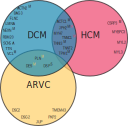

# Prevalence and disease expression of pathogenic and likely pathogenic variants associated with inherited cardiomyopathies in the general population

__version__: `1.0`

[](https://doi.org/10.1161/CIRCGEN.122.003704)
[](https://choosealicense.com/licenses/cc-by-sa-4.0)
[](https://zenodo.org/badge/latestdoi/386120447)


> This README and repository accompany the paper _"Prevalence and Disease Expression of Pathogenic and Likely Pathogenic Variants Associated With Inherited Cardiomyopathies in the General Population"_ by [Bourfiss M. *et al*. **Circ Genom Precis Med. (2022)**](https://doi.org/10.1161/CIRCGEN.122.003704).
--------------

# Content
```
.
├── .gitignore
├── CITATION.cff
├── LICENSE.md
├── README.md
├── bin                <- Useful software used in the analyses 
├── config             <- Configuration file
├── data               <- All project data
│   ├── processed      <- The final, canonical data sets, ignored by git
│   ├── raw            <- Raw data necessary to build the final data
│   └── temp           <- Intermediate data that has been transformed
├── docs               <- Documentation 
│   ├── manuscript     <- Manuscript 
├── results
│   ├── figures        <- Figures for the manuscript 
│   └── output         <- Other output for the manuscript or reports
└── src                <- Source code for this project 
```

# Abstract

## Background
Pathogenic and likely pathogenic variants associated with arrhythmogenic right ventricular cardiomyopathy (ARVC), dilated cardiomyopathy (DCM) and hypertrophic cardiomyopathy (HCM) are recommended to be reported as secondary findings in genome sequencing studies. This provides opportunities for early diagnosis, but also fuels uncertainty in variant carriers (G+), since disease penetrance is incomplete. We assessed the prevalence and disease expression of G+ in the general population.

## Methods
:warning: Scripts and examples in this repository are shared for transparency purpose only and may therefore not work on other systems without modifications.
### Genetic variants in the study population
For each inherited cardiomyopathy we selected curated genes classified to have definite, strong or moderate evidence of pathogenicity (see **Figure 1**).


**Figure 1. Included curated genes per cardiomyopathy**
The Venn diagram of curated genes included in this study shows the overlap in genes per cardiomyopathy. Unless otherwise indicated, pathogenicity of genes are classified as definitive. If a superscript S or M is given, genes are classified as having a strong or moderate pathogenicity respectively. In the overlapping circles, yellow, black and red colors refer to ARVC, DCM, and HCM respectively. **[Table S1](docs/manuscript/Supplementary_Tables.pdf)** gives an overview of the included genes and pathogenicity classification per gene and abbreviation per gene.
*Abbreviations: ARVC= arrhythmogenic right ventricular cardiomyopathy; DCM= dilated cardiomyopathy; HCM= hypertrophic cardiomyopathy.*

We identified pathogenic and likely pathogenic variants associated with ARVC, DCM and/or HCM in these curated genes and included UK Biobank individuals carrying these variants. We calculated the prevalence of G+ and analysed the frequency of cardiomyopathy/heart failure diagnosis. In undiagnosed individuals, we analysed early signs of disease expression. 

## Results

We found a prevalence of 1:578, 1:251 and 1:149 for (likely) pathogenic variants associated with ARVC, DCM and HCM respectively. Compared to controls, cardiovascular mortality was higher in DCM G+ (OR 1.67 [95% CI 1.04;2.59], p=0.030), but similar in ARVC and HCM G+ (p≥0.100). More specifically, cardiomyopathy or heart failure diagnosis were more frequent in DCM G+ (OR 3.66 [95% CI 2.24;5.81], p=4.9×10-7) and HCM G+ (OR 3.03 [95% CI 1.98;4.56], p=5.8×10-7), but comparable in ARVC G+ (p=0.172). In contrast, ARVC G+ had more ventricular arrhythmias (p=3.3×10-4) (**[Figure 4](docs/manuscript/Figures.pdf)**). In undiagnosed individuals, left ventricular ejection fraction was reduced in DCM G+ (p=0.009).

## Conclusions

In the general population, (likely) pathogenic variants associated with ARVC, DCM or HCM are not uncommon. Although G+ have increased mortality and morbidity, disease penetrance in these carriers from the general population remains low (1.2-3.1%). Follow-up decisions in case of incidental findings should not be based solely on the variant, but on multiple factors, including family history.

# Get started

In the [src folder](src) all scripts can be found. See the accompanying [README](src/README.md) for further instructions. 
